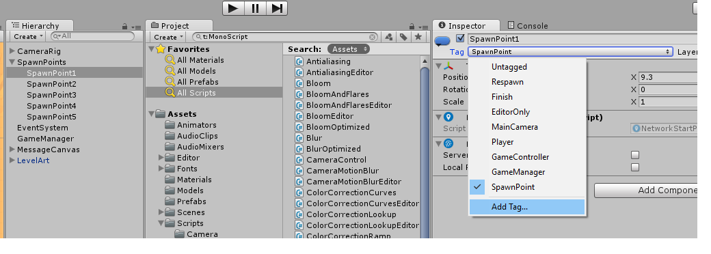

# Tanks
Denne oppgaven tar utgangspunkt i [dette](http://unity3d.com/learn/tutorials/projects/tanks-tutorial) prosjektet på Unity sine sider.

Først så må vi starte Unity og velge et nytt prosjekt. Prosjektet kan man kalle hva man selv vil, vi kommer til å kalle det for Tanks i denne tutorialen. Når vi har åpnet Unity så må vi laste ned alle prosjekt filene, dette gjør vi ved å velge **Window** oppe på verktøylinjen og velger **Asset Store**. Inne i **Asset Store** så søker vi på **Tanks Tutorial**. Når vi har funnet prosjektet så klikker vi på Download og Import etter nedlastingen er ferdig.


## 1 Sette Opp Prosjektet

- Velg `File -> New Scene` oppe på verktøylinjen for å lage en ny Scene, lagre den nye scenen som `Main` i `Scenes` mappen.
- Slett lyskilden som heter `Directional Light` i hierarkiet fra scenen.
- Dra `Prefaben` som heter **Level Art** inn i hierarkiet. Denne ligger i mappen `Prefabs` i prosjektet:


- Fra `Window` menyen, åpne `Lighting` panelet. På dette panelet så skrur vi av **Auto** helt nederst på vinduet og **Baked GI**. Under **Precomputed Realtime GI** så setter vi `Realtime Resolution` til 0.5:


- Under **Environment Lighting** forandre `Ambient Source` fra `Skybox` til `Color` og bytt fargen til RGB verdiene (72,62,113).
- Klikk Build nederst på Panelet.
- Lukk `Lighting` panelet, eller klikk på `Inspector` panelet.
- Velg `Main Camera` fra hierarkiet og bytt posisjon til (-43,42,-25)
- Bytt rotasjon til (40,60,0)
- Forandre kameraet sin `Projection` til `Ortographic`
- Forandre kameraet sin `Clear Flags` fra `Skybox` til `Solid Color`.
- Forandre `Background` farge til RGB (80,60,50)
- Lagre Scenen din.


# Miniquiz

### Hva kalles de tre koordinatene vi bruker til å si posisjonen til noe i Unity?
1. ZXE
2. BHD
3. XYZ
4. ABC

### Hvilke 3 farger består RGB av?
1. Rød, Gul, Brun
2. Rosa, Grønn, Beige
3. Rosa, Grønn, Burgunder
4. Rød, Grønn, Blå


## 2 Lage En Tank

- Under mappen `Models` finner du en modell som heter `Tank`. Dra denne inn i hierarkiet, på samme måte som vi gjorde med `LevelArt`.
- Forandre `Layer` til tanksen slik at den ligger på `Players` layeret. I Dialogboksen velger du `No, for this object only`


- Legg til en `Rigidbody` til tanksen.
- Under `Constraints` inne i `Rigidbody`, huk av for `Freeze Position` på Y-aksen, og huk av for `Freeze Rotation` på X-aksen og Z-aksen.
- Legg til en `Box Collider` på tanksen og forandre `Center` til (0, 0.85, 0) og forandre størrelsen til (1.5, 1.7, 1.6).
- Legg til en `Audio Source` til tanksen vår og forandre `Audio Clip` til `Engine Idle`. Huk også av for `Loop`.


- Legg til en ekstra `Audio Source` på tanksen vår og slå av `Play On Awake`.
- Velg `Prefabs` mappen i prosjektet vårt og dra tanksen ned til mappen, det som skjer er at vi lager en `Prefab` av tanksen vi har lagd til nå. En `Prefab` er et ferdiglaget objekt som inneholder alt vi har lagt til tanksen vår til nå.


- Fra `Prefabs` mappen, dra `DustTrail` prefaben til tanksen vår i hierarkiet, slik at den blir en `Child` av tanks objektet vårt.
- Dupliser `DustTrail` ved å bruke Ctrl + D slik at vi får to `DustTrail` på tanksen vår. Gi den nye `DustTrail` navnet `LeftDustTrail` og den andre navnet `RightDustTrail`.
- Sett posisjonen til `LeftDustTrail` til (-0.5, 0, -0.75) og posisjonen til `RightDustTrail` til (0.5, 0, -0.75)

### Tid for litt Kode
- I `Scripts/Tank` folderen så finner vi et script som heter `TankMovement`, dra denne over på tanksen vår i hierarkiet.
- Dobbelklikk på `TankMovement` scriptet for å åpne scriptet i Visual Studio eller MonoDevelop.
- I scriptet så har vi noen ferdiglagde funksjoner, disse er kommentert ut, så vi må fjerne kommentar tegnene `/* */`
- Koden for scriptet ligger under, men vi vil gjerne tenke oss frem til hva vi vil gjøre først.


```

 	private void Update ()
    {
        // Store the value of both input axes.
        m_MovementInputValue = Input.GetAxis (m_MovementAxisName);
        m_TurnInputValue = Input.GetAxis (m_TurnAxisName);

        EngineAudio ();
    }


    private void EngineAudio ()
    {
        // If there is no input (the tank is stationary)...
        if (Mathf.Abs (m_MovementInputValue) < 0.1f && Mathf.Abs (m_TurnInputValue) < 0.1f)
        {
            // ... and if the audio source is currently playing the driving clip...
            if (m_MovementAudio.clip == m_EngineDriving)
            {
                // ... change the clip to idling and play it.
                m_MovementAudio.clip = m_EngineIdling;
                m_MovementAudio.pitch = Random.Range (m_OriginalPitch - m_PitchRange, m_OriginalPitch + m_PitchRange);
                m_MovementAudio.Play ();
            }
        }
        else
        {
            // Otherwise if the tank is moving and if the idling clip is currently playing...
            if (m_MovementAudio.clip == m_EngineIdling)
            {
                // ... change the clip to driving and play.
                m_MovementAudio.clip = m_EngineDriving;
                m_MovementAudio.pitch = Random.Range(m_OriginalPitch - m_PitchRange, m_OriginalPitch + m_PitchRange);
                m_MovementAudio.Play();
            }
        }
    }


    private void FixedUpdate ()
    {
        // Adjust the rigidbodies position and orientation in FixedUpdate.
        Move ();
        Turn ();
    }


    private void Move ()
    {
        // Create a vector in the direction the tank is facing with a magnitude based on the input, speed and the time between frames.
        Vector3 movement = transform.forward * m_MovementInputValue * m_Speed * Time.deltaTime;

        // Apply this movement to the rigidbody's position.
        m_Rigidbody.MovePosition(m_Rigidbody.position + movement);
    }


    private void Turn ()
    {
        // Determine the number of degrees to be turned based on the input, speed and time between frames.
        float turn = m_TurnInputValue * m_TurnSpeed * Time.deltaTime;

        // Make this into a rotation in the y axis.
        Quaternion turnRotation = Quaternion.Euler (0f, turn, 0f);

        // Apply this rotation to the rigidbody's rotation.
        m_Rigidbody.MoveRotation (m_Rigidbody.rotation * turnRotation);
    }
```

# Miniquiz

### Hva er en Prefab?
1. En Unity pakke for Grafikk
2. Et ferdiglagd objekt som vi kan bruke i Unity
3. Et bilde
4. En ny smarttelefon

### Hva er en variabel?
1. Et navn som holder en verdi i programmet vårt
2. Et program som varierer i hvor bra det er
3. En ukjent verdi som vi ikke kan se på
4. Et program som gir varierende resultat


### Hva betyr public i Unity?
1. Public betyr at noe kan nåes overalt i programmet vårt
2. Public betyr at det ligger ute på nett
3. Public betyr at noe er lagd i all offentlighet
4. Public betyr ingenting i Unity


## 3 Kamera Kontroll

- Lag et nytt `Empty GameObject` i hierarkiet og kall det for `Camera Rig`


- Sett posisjonen til `Camera Rig` tilbake til (0, 0, 0) og sett `Rotation` til (40, 60, 0)
- I hierarkiet, dra `Main Camera` til det nye `Camera Rig` objektet vårt, slik at `Main Camera` blir et child av `Camera Rig`
- Sett posisjonen til `Main Camera` (Ikke `Camera Rig`) til (0, 0, -65)
- Lag et nytt script under `Scripts` som heter `CameraControl` og åpne scriptet.
- I dette scriptet så skal vi sette opp kameraet til å Zoome ved å sette størrelsen på the ortografiske kameraet.
- Vi vil også at kameraet skal følge begge tanksene.

```

	using UnityEngine;
	
	public class CameraControl : MonoBehaviour
	{
	    public float m_DampTime = 0.2f;                 // Approximate time for the camera to refocus.
	    public float m_ScreenEdgeBuffer = 4f;           // Space between the top/bottom most target and the screen edge.
	    public float m_MinSize = 6.5f;                  // The smallest orthographic size the camera can be.
	    [HideInInspector] public Transform[] m_Targets; // All the targets the camera needs to encompass.
	
	
	    private Camera m_Camera;                        // Used for referencing the camera.
	    private float m_ZoomSpeed;                      // Reference speed for the smooth damping of the orthographic size.
	    private Vector3 m_MoveVelocity;                 // Reference velocity for the smooth damping of the position.
	    private Vector3 m_DesiredPosition;              // The position the camera is moving towards.
	
	
	    private void Awake ()
	    {
	        m_Camera = GetComponentInChildren<Camera> ();
	    }
	
	
	    private void FixedUpdate ()
	    {
	        // Move the camera towards a desired position.
	        Move ();
	
	        // Change the size of the camera based.
	        Zoom ();
	    }
	
	
	    private void Move ()
	    {
	        // Find the average position of the targets.
	        FindAveragePosition ();
	
	        // Smoothly transition to that position.
	        transform.position = Vector3.SmoothDamp(transform.position, m_DesiredPosition, ref m_MoveVelocity, m_DampTime);
	    }
	
	
	    private void FindAveragePosition ()
	    {
	        Vector3 averagePos = new Vector3 ();
	        int numTargets = 0;
	
	        // Go through all the targets and add their positions together.
	        for (int i = 0; i < m_Targets.Length; i++)
	        {
	            // If the target isn't active, go on to the next one.
	            if (!m_Targets[i].gameObject.activeSelf)
	                continue;
	
	            // Add to the average and increment the number of targets in the average.
	            averagePos += m_Targets[i].position;
	            numTargets++;
	        }
	
	        // If there are targets divide the sum of the positions by the number of them to find the average.
	        if (numTargets > 0)
	            averagePos /= numTargets;
	
	        // Keep the same y value.
	        averagePos.y = transform.position.y;
	
	        // The desired position is the average position;
	        m_DesiredPosition = averagePos;
	    }
	
	
	    private void Zoom ()
	    {
	        // Find the required size based on the desired position and smoothly transition to that size.
	        float requiredSize = FindRequiredSize();
	        m_Camera.orthographicSize = Mathf.SmoothDamp (m_Camera.orthographicSize, requiredSize, ref m_ZoomSpeed, m_DampTime);
	    }
	
	
	    private float FindRequiredSize ()
	    {
	        // Find the position the camera rig is moving towards in its local space.
	        Vector3 desiredLocalPos = transform.InverseTransformPoint(m_DesiredPosition);
	
	        // Start the camera's size calculation at zero.
	        float size = 0f;
	
	        // Go through all the targets...
	        for (int i = 0; i < m_Targets.Length; i++)
	        {
	            // ... and if they aren't active continue on to the next target.
	            if (!m_Targets[i].gameObject.activeSelf)
	                continue;
	
	            // Otherwise, find the position of the target in the camera's local space.
	            Vector3 targetLocalPos = transform.InverseTransformPoint(m_Targets[i].position);
	
	            // Find the position of the target from the desired position of the camera's local space.
	            Vector3 desiredPosToTarget = targetLocalPos - desiredLocalPos;
	
	            // Choose the largest out of the current size and the distance of the tank 'up' or 'down' from the camera.
	            size = Mathf.Max(size, Mathf.Abs(desiredPosToTarget.y));
	
	            // Choose the largest out of the current size and the calculated size based on the tank being to the left or right of the camera.
	            size = Mathf.Max(size, Mathf.Abs(desiredPosToTarget.x) / m_Camera.aspect);
	        }
	
	        // Add the edge buffer to the size.
	        size += m_ScreenEdgeBuffer;
	
	        // Make sure the camera's size isn't below the minimum.
	        size = Mathf.Max (size, m_MinSize);
	
	        return size;
	    }
	
	
	    public void SetStartPositionAndSize ()
	    {
	        // Find the desired position.
	        FindAveragePosition ();
	
	        // Set the camera's position to the desired position without damping.
	        transform.position = m_DesiredPosition;
	
	        // Find and set the required size of the camera.
	        m_Camera.orthographicSize = FindRequiredSize ();
	    }
	}


```

- Dra `Camera Control` scriptet over på vår `Camera Rig`
- Test spillet
- Lager Scenen

# Miniquiz

### For en skjerm som har 1920x1080 pixler og `Aspect Ratio` 16:9, hvordan finner vi aspectet?
1. 1920 / 1080
2. 1920 * 1080
3. 1080 * 9
4. 16/9

### Med et `Ortografisk` kamera, hva skjer når vi zoomer inn?
1. Vi flytter kameraets posisjon nærmere
2. Vi øker kameraets ortografiske størrelse
3. Vi minsker kameraets ortografiske størrelse
4. Øker kameraets aspekt


### Hva betyr `Aspect Ratio`?
1. Størrelsen til hvert pixel
2. Bredden på skjermen
3. Forholdet mellom størrelser i x og y retning
4. Høyden på skjermen


## 4 Helse
- Sett transform toggelen til `Pivot`, ikke `Center`


- Lag en `Slider` som ligger under `GameObject > UI > Slider`


- Når man lager en `Slider` så kan man se at det dukker opp flere komponenter slik som `Canvas` og `EventSystem`, disse må være her for at Helsen til tanksen vår skal fungere korrekt.
- Velg nå `EventSystem` objektet i hierarkiet og under `Standalone Input Model` komponenten, forandre `Horizontal Axis` og `Vertical Axis` til `HorizontalUI` og `VerticalUI`.


- Velg `Canvas` objektet og forandre `Reference Pixels per Unit` til 1 under `Canvas Scaler` komponenten. Forandre så `Render Mode` til `World Space` under `Canvas` komponenten til `Canvas` objektet.
- I hierarkiet, dra `Canvas` til `Tank` objektet for å gjøre `Canvas` til et child av `Tanksen`.
- Sett posisjonen til `Canvas` til (0, 0.1, 0).
- Forandre `Width` og `Height` til 3.5
- Forandre rotasjonen til (90, 0, 0)
- Lagre scenen

- Klikk den lille pilen ved siden av `Canvas` så man kan se alt den inneholder.
- Velg `HandleSlideArea` og slett denne.
- Velg så alle elementene som ligger under `Canvas` og klikk på `Anchor Preset` knappen


- Hold inne `Alt` knappen på tastaturet og klikk på den preseten som ligger i høyre hjørne


- Du vil nå se at den lille firkanten som ligger under tanksen er grå
- Klikk så på `Slider` under `Canvas` og slå av knappen `Interactable`.
- Forandre `Transition` til None.
- Sett verdien til slideren til 100.
- Skift navn på slideren til `HealthSlider` og velg `Background` objektet på slideren.
- På `Source Image` komponenten så forandrer vi `Background` til `Health Wheel`
- Trykk på `Color` og forandre `A` (eller `Alpha`) verdien til 80
- Klikk på `Fill` child objektet, og under `Source` image velg `Health Wheel` igjen.
- Skift `A` til 150 under `Color`

- Velg så `Image Type` filled. `Fill Origin` skal stå på left og slå av knappen `Clockwise`


- I `Scripts` folderen, dra scriptet `UIDirectionControl` til `HealthSlider`
- Klikk på Tanks objektet i hierarkiet og klikk `Apply` helt på toppen for å oppdatere prefaben.
- Lagre Scenen din.

- Åpne `Prefabs` folderen og dra `TankExplosion` inn i hierarkiet.
- Velg `TankExplosion` og legg til en `Audio Source` i komponentene. Under `Audio Clip` velg `TankExplosion` lyden og klikk av `Play On Awake`.
- Klikk `Apply` på `TankExplosion` objektet. Og så slett objektet når du er ferdig.
- Finn `TankHealth` scriptet i `Scripts/Tank` og dra det til `Tank` objektet, åpne så scriptet.

```

	using UnityEngine;
	using UnityEngine.UI;
	
	public class TankHealth : MonoBehaviour
	{
	    public float m_StartingHealth = 100f;               // The amount of health each tank starts with.
	    public Slider m_Slider;                             // The slider to represent how much health the tank currently has.
	    public Image m_FillImage;                           // The image component of the slider.
	    public Color m_FullHealthColor = Color.green;       // The color the health bar will be when on full health.
	    public Color m_ZeroHealthColor = Color.red;         // The color the health bar will be when on no health.
	    public GameObject m_ExplosionPrefab;                // A prefab that will be instantiated in Awake, then used whenever the tank dies.
	    
	    
	    private AudioSource m_ExplosionAudio;               // The audio source to play when the tank explodes.
	    private ParticleSystem m_ExplosionParticles;        // The particle system the will play when the tank is destroyed.
	    private float m_CurrentHealth;                      // How much health the tank currently has.
	    private bool m_Dead;                                // Has the tank been reduced beyond zero health yet?
	
	
	    private void Awake ()
	    {
	        // Instantiate the explosion prefab and get a reference to the particle system on it.
	        m_ExplosionParticles = Instantiate (m_ExplosionPrefab).GetComponent<ParticleSystem> ();
	
	        // Get a reference to the audio source on the instantiated prefab.
	        m_ExplosionAudio = m_ExplosionParticles.GetComponent<AudioSource> ();
	
	        // Disable the prefab so it can be activated when it's required.
	        m_ExplosionParticles.gameObject.SetActive (false);
	    }
	
	
	    private void OnEnable()
	    {
	        // When the tank is enabled, reset the tank's health and whether or not it's dead.
	        m_CurrentHealth = m_StartingHealth;
	        m_Dead = false;
	
	        // Update the health slider's value and color.
	        SetHealthUI();
	    }
	
	
	    public void TakeDamage (float amount)
	    {
	        // Reduce current health by the amount of damage done.
	        m_CurrentHealth -= amount;
	
	        // Change the UI elements appropriately.
	        SetHealthUI ();
	
	        // If the current health is at or below zero and it has not yet been registered, call OnDeath.
	        if (m_CurrentHealth <= 0f && !m_Dead)
	        {
	            OnDeath ();
	        }
	    }
	
	
	    private void SetHealthUI ()
	    {
	        // Set the slider's value appropriately.
	        m_Slider.value = m_CurrentHealth;
	
	        // Interpolate the color of the bar between the choosen colours based on the current percentage of the starting health.
	        m_FillImage.color = Color.Lerp (m_ZeroHealthColor, m_FullHealthColor, m_CurrentHealth / m_StartingHealth);
	    }
	
	
	    private void OnDeath ()
	    {
	        // Set the flag so that this function is only called once.
	        m_Dead = true;
	
	        // Move the instantiated explosion prefab to the tank's position and turn it on.
	        m_ExplosionParticles.transform.position = transform.position;
	        m_ExplosionParticles.gameObject.SetActive (true);
	
	        // Play the particle system of the tank exploding.
	        m_ExplosionParticles.Play ();
	
	        // Play the tank explosion sound effect.
	        m_ExplosionAudio.Play();
	
	        // Turn the tank off.
	        gameObject.SetActive (false);
	    }
	}

```

- Lagre koden din, og trykk `Apply` på toppen av `Tank` objektet.
- Lagre Scenen.
##
- Nå må vi sette opp alle `public` variabler som vi skal bruke i `TankHealth` scriptet vårt.
- Velg `Tank` objektet i hierarkiet
- Dra `HealthSlider` til `Slider` variablen vår på `TankHealth` scriptet, dette vil ligge nederst på Tank objektet i `Inspector`
- Gjør det samme med `Fill` objektet på Tanksen vår, den skal draes til `FillImage`
- Dra `TankExplosion` prefaben til `ExplosionPrefab` variablen
- Klikk `Apply` på tanksen vår og lagre Scenen

## 5 Kuler
- Finn `Shell` i `Models` mappen og dra denne inn i hierarkiet
- Legg til en `Capsule Collider` på `Shell` objektet
- Slå på `IsTrigger` under `Capsule Collider` som vi akkurat la til
- Sett `Direction` på collideren til Z-aksen
- Forandre `Center` av `Capsule Collider` til (0, 0, 0.2)
- Forandre `Radius` til 0.15 og `Height` til 0.55
- Legg til en `Rigidbody` på `Shell` objektet
##
- Finn prefaben `ShellExplosion` i `Prefabs` mappen og dra den til `Shell` slik at den blir en child av `Shell`
- Legg til en `AudioSource` til `ShellExplosion`
- Sett `AudioClip` til `ShellExplosion` og slå av `Play on Awake`
##
- Velg `Shell` objektet igjen og legg til en `Light` komponent
- I `Scripts/Shell` folderen, dra `ShellExplosion` scriptet til `Shell`
- Åpne scriptet

```

	using UnityEngine;
	
	public class ShellExplosion : MonoBehaviour
	{
	    public LayerMask m_TankMask;                        // Used to filter what the explosion affects, this should be set to "Players".
	    public ParticleSystem m_ExplosionParticles;         // Reference to the particles that will play on explosion.
	    public AudioSource m_ExplosionAudio;                // Reference to the audio that will play on explosion.
	    public float m_MaxDamage = 100f;                    // The amount of damage done if the explosion is centred on a tank.
	    public float m_ExplosionForce = 1000f;              // The amount of force added to a tank at the centre of the explosion.
	    public float m_MaxLifeTime = 2f;                    // The time in seconds before the shell is removed.
	    public float m_ExplosionRadius = 5f;                // The maximum distance away from the explosion tanks can be and are still affected.
	
	
	    private void Start ()
	    {
	        // If it isn't destroyed by then, destroy the shell after it's lifetime.
	        Destroy (gameObject, m_MaxLifeTime);
	    }
	
	
	    private void OnTriggerEnter (Collider other)
	    {
	        // Collect all the colliders in a sphere from the shell's current position to a radius of the explosion radius.
	        Collider[] colliders = Physics.OverlapSphere (transform.position, m_ExplosionRadius, m_TankMask);
	
	        // Go through all the colliders...
	        for (int i = 0; i < colliders.Length; i++)
	        {
	            // ... and find their rigidbody.
	            Rigidbody targetRigidbody = colliders[i].GetComponent<Rigidbody> ();
	
	            // If they don't have a rigidbody, go on to the next collider.
	            if (!targetRigidbody)
	                continue;
	
	            // Add an explosion force.
	            targetRigidbody.AddExplosionForce (m_ExplosionForce, transform.position, m_ExplosionRadius);
	
	            // Find the TankHealth script associated with the rigidbody.
	            TankHealth targetHealth = targetRigidbody.GetComponent<TankHealth> ();
	
	            // If there is no TankHealth script attached to the gameobject, go on to the next collider.
	            if (!targetHealth)
	                continue;
	
	            // Calculate the amount of damage the target should take based on it's distance from the shell.
	            float damage = CalculateDamage (targetRigidbody.position);
	
	            // Deal this damage to the tank.
	            targetHealth.TakeDamage (damage);
	        }
	
	        // Unparent the particles from the shell.
	        m_ExplosionParticles.transform.parent = null;
	
	        // Play the particle system.
	        m_ExplosionParticles.Play();
	
	        // Play the explosion sound effect.
	        m_ExplosionAudio.Play();
	
	        // Once the particles have finished, destroy the gameobject they are on.
	        Destroy (m_ExplosionParticles.gameObject, m_ExplosionParticles.duration);
	
	        // Destroy the shell.
	        Destroy (gameObject);
	    }
	
	
	    private float CalculateDamage (Vector3 targetPosition)
	    {
	        // Create a vector from the shell to the target.
	        Vector3 explosionToTarget = targetPosition - transform.position;
	
	        // Calculate the distance from the shell to the target.
	        float explosionDistance = explosionToTarget.magnitude;
	
	        // Calculate the proportion of the maximum distance (the explosionRadius) the target is away.
	        float relativeDistance = (m_ExplosionRadius - explosionDistance) / m_ExplosionRadius;
	
	        // Calculate damage as this proportion of the maximum possible damage.
	        float damage = relativeDistance * m_MaxDamage;
	
	        // Make sure that the minimum damage is always 0.
	        damage = Mathf.Max (0f, damage);
	
	        return damage;
	    }
	}

```

- Mens man fortsatt har `Shell` valgt, dra child objektet `ShellExplosion` til `ExplosionParticles` og `ExplosionAudio` variablene
- Sett `TankMask` variablen til `Players`
- Dra `Shell` objektet til `Prefabs` folderen.
- Slett `Shell` objektet fra hierarkiet og lagre scenen.

## 6 Skyting

- Velg Tanksen vår i hierarkiet
- Høyre-klikk på Tanksen vår og velg `Crate Empty`, gi denne navnet `FireTransform`
- Sett posisjonen til (0, 1.7, 1.35) og rotasjonen til (350, 0, 0)
- Høyreklikk på `Canvas` objektet vårt i hierarkiet og velg `UI > Slider`
- Gi den nye slideren navnet `AimSlider`
##
- Hold inne `Alt` og klikk på pilen ved siden av `AimSlider` for å vise alle children av objektet
- Slett `Background` og `Handle Slider Area` fra objektet
- Skru av `Interactable`
- Sett `Transition` til `None`
- Sett `Direction` til `Bottom to Top`
- Sett `Min Value` til 15 og `Max Value` til 30
- Velg både `AimSlider` og `Fill Area`
- I deres `Rect Transform` klikk på `Anchor Preset` og hold inn `Alt` mens du klikker på den preseten ned i høyre hjørne, `Stretch`
- Åpne `Fill Area` og velg `Fill`
- På `Rect Transform` sett `Height` til 0
- Under `Fill` komponenten forandre `Source Image` til `Aim Arrow`

##
- Velg `AimSlider` og bruk `Rect Tool`, du kan velge det ved å trykke på `T` på tastaturet
- Dra firkanten slik at den er cirka like bred som tanksen, og litt lengre foran tanksen
- Finn `TankShooting` scriptet i `Scripts/Tank` og dra det over på Tanksen vår
- Åpne Scriptet

```

	using UnityEngine;
	using UnityEngine.UI;
	
	public class TankShooting : MonoBehaviour
	{
	    public int m_PlayerNumber = 1;              // Used to identify the different players.
	    public Rigidbody m_Shell;                   // Prefab of the shell.
	    public Transform m_FireTransform;           // A child of the tank where the shells are spawned.
	    public Slider m_AimSlider;                  // A child of the tank that displays the current launch force.
	    public AudioSource m_ShootingAudio;         // Reference to the audio source used to play the shooting audio. NB: different to the movement audio source.
	    public AudioClip m_ChargingClip;            // Audio that plays when each shot is charging up.
	    public AudioClip m_FireClip;                // Audio that plays when each shot is fired.
	    public float m_MinLaunchForce = 15f;        // The force given to the shell if the fire button is not held.
	    public float m_MaxLaunchForce = 30f;        // The force given to the shell if the fire button is held for the max charge time.
	    public float m_MaxChargeTime = 0.75f;       // How long the shell can charge for before it is fired at max force.
	
	
	    private string m_FireButton;                // The input axis that is used for launching shells.
	    private float m_CurrentLaunchForce;         // The force that will be given to the shell when the fire button is released.
	    private float m_ChargeSpeed;                // How fast the launch force increases, based on the max charge time.
	    private bool m_Fired;                       // Whether or not the shell has been launched with this button press.
	
	
	    private void OnEnable()
	    {
	        // When the tank is turned on, reset the launch force and the UI
	        m_CurrentLaunchForce = m_MinLaunchForce;
	        m_AimSlider.value = m_MinLaunchForce;
	    }
	
	
	    private void Start ()
	    {
	        // The fire axis is based on the player number.
	        m_FireButton = "Fire" + m_PlayerNumber;
	
	        // The rate that the launch force charges up is the range of possible forces by the max charge time.
	        m_ChargeSpeed = (m_MaxLaunchForce - m_MinLaunchForce) / m_MaxChargeTime;
	    }
	
	
	    private void Update ()
	    {
	        // The slider should have a default value of the minimum launch force.
	        m_AimSlider.value = m_MinLaunchForce;
	
	        // If the max force has been exceeded and the shell hasn't yet been launched...
	        if (m_CurrentLaunchForce >= m_MaxLaunchForce && !m_Fired)
	        {
	            // ... use the max force and launch the shell.
	            m_CurrentLaunchForce = m_MaxLaunchForce;
	            Fire ();
	        }
	        // Otherwise, if the fire button has just started being pressed...
	        else if (Input.GetButtonDown (m_FireButton))
	        {
	            // ... reset the fired flag and reset the launch force.
	            m_Fired = false;
	            m_CurrentLaunchForce = m_MinLaunchForce;
	
	            // Change the clip to the charging clip and start it playing.
	            m_ShootingAudio.clip = m_ChargingClip;
	            m_ShootingAudio.Play ();
	        }
	        // Otherwise, if the fire button is being held and the shell hasn't been launched yet...
	        else if (Input.GetButton (m_FireButton) && !m_Fired)
	        {
	            // Increment the launch force and update the slider.
	            m_CurrentLaunchForce += m_ChargeSpeed * Time.deltaTime;
	
	            m_AimSlider.value = m_CurrentLaunchForce;
	        }
	        // Otherwise, if the fire button is released and the shell hasn't been launched yet...
	        else if (Input.GetButtonUp (m_FireButton) && !m_Fired)
	        {
	            // ... launch the shell.
	            Fire ();
	        }
	    }
	
	
	    private void Fire ()
	    {
	        // Set the fired flag so only Fire is only called once.
	        m_Fired = true;
	
	        // Create an instance of the shell and store a reference to it's rigidbody.
	        Rigidbody shellInstance =
	            Instantiate (m_Shell, m_FireTransform.position, m_FireTransform.rotation) as Rigidbody;
	
	        // Set the shell's velocity to the launch force in the fire position's forward direction.
	        shellInstance.velocity = m_CurrentLaunchForce * m_FireTransform.forward; ;
	
	        // Change the clip to the firing clip and play it.
	        m_ShootingAudio.clip = m_FireClip;
	        m_ShootingAudio.Play ();
	
	        // Reset the launch force.  This is a precaution in case of missing button events.
	        m_CurrentLaunchForce = m_MinLaunchForce;
	    }
	}
```

##
- Nå må vi sette alle `public` variablene i `TankShooting` scriptet vårt
- Finn `Shell` fra prefabs og dra det til `Shell` variablen
- Dra `FireTransform` komponenten til `FireTransform` variablen
- Finn `AimSlider`, som er en child av `Canvas` og dra den til `AimSlider` variablen
- Den andre (tomme) `AudioSourcen` som ligger på Tanksen vår drar vi til `Shooting Audio` variablen
- Sett `Charging Clip` variablen til `ShotCharging`
- Sett `Fire Clip` variablen til `ShotFiring`
- Klikk `Apply` øverst i Tanks objektet vårt og lagre scenen

# Tanksen vår er nå ferdig, test den ut :)

## 7 Game Manager

- Lag to nye `Empty GameObjects` i hierarkiet og kall dem for `SpawnPoint1` og `SpawnPoint2`
- Sett posisjonen til første spawn til (-3, 0, 30) og andre og rotatsjon til (0, 180, 0)
- Sett posisjonen til andre spawn til (13, 0, -5), rotasjon skal stå på (0, 0, 0)
- Trykk på `Gizmoen` til SpawnPoint1 og forandre den til Blå
- Trykk på `Gizmoen` til SpawnPoint2 og forandre den til Rød
- Lag et nytt Canvas i hierarkiet og gi det navnet `MessageCanvas`
- Klikk på 2D knappen øverst i scenen vår, og posisjoner deg så du kan se hele Canvaset
- Høyreklikk på `MessageCanvas` og legg til et `Text` objekt
- På `RectTransform` komponenten til `Text` objektet, sett Anchor for X og Y til Min: 0,1 og Max: 0,9
- Skriv inn `TANKS!!` i tekstfeltet til `Text` objektet
- Forandre `Font` til `BowlbyOne-regular` ved å bruke sirkelen ved siden av `Font` feltet
- Forandre alignment til senter og midten
- Klikk på `Enable Best Fit`, sett max size til 60 og forandre farge til hvit

- Gå til `CameraRig` og forandre `Size` i target variablen til 0 og trykk enter
- Lag et nytt `Empty GameObject` og kall objektet `GameManager`
- Finn `GameManager` objektet i `Scripts/GameManager` og dra det til `GameManager` objektet
- Dra inn alle objektene som skal være i `Public` variablene til `GameManager` scriptet
- Åpne `Tanks` variablen (array) og sett størrelsen til 2
- Dra `SpawnPoint1` til Element 0 og forandre farge, gjør det samme for Element 1
- Lagre Scenen din

```
using System.Collections;
using UnityEngine;
using UnityEngine.UI;

    public class GameManager : MonoBehaviour
    {
        public int m_NumRoundsToWin = 5;            // The number of rounds a single player has to win to win the game.
        public float m_StartDelay = 3f;             // The delay between the start of RoundStarting and RoundPlaying phases.
        public float m_EndDelay = 3f;               // The delay between the end of RoundPlaying and RoundEnding phases.
        public CameraControl m_CameraControl;       // Reference to the CameraControl script for control during different phases.
        public Text m_MessageText;                  // Reference to the overlay Text to display winning text, etc.
        public GameObject m_TankPrefab;             // Reference to the prefab the players will control.
        public TankManager[] m_Tanks;               // A collection of managers for enabling and disabling different aspects of the tanks.

        
        private int m_RoundNumber;                  // Which round the game is currently on.
        private WaitForSeconds m_StartWait;         // Used to have a delay whilst the round starts.
        private WaitForSeconds m_EndWait;           // Used to have a delay whilst the round or game ends.
        private TankManager m_RoundWinner;          // Reference to the winner of the current round.  Used to make an announcement of who won.
        private TankManager m_GameWinner;           // Reference to the winner of the game.  Used to make an announcement of who won.


        private void Start()
        {
            // Create the delays so they only have to be made once.
            m_StartWait = new WaitForSeconds (m_StartDelay);
            m_EndWait = new WaitForSeconds (m_EndDelay);

            SpawnAllTanks();
            SetCameraTargets();

            // Once the tanks have been created and the camera is using them as targets, start the game.
            StartCoroutine (GameLoop ());
        }


        private void SpawnAllTanks()
        {
            // For all the tanks...
            for (int i = 0; i < m_Tanks.Length; i++)
            {
                // ... create them, set their player number and references needed for control.
                m_Tanks[i].m_Instance =
                    Instantiate(m_TankPrefab, m_Tanks[i].m_SpawnPoint.position, m_Tanks[i].m_SpawnPoint.rotation) as GameObject;
                m_Tanks[i].m_PlayerNumber = i + 1;
                m_Tanks[i].Setup();
            }
        }


        private void SetCameraTargets()
        {
            // Create a collection of transforms the same size as the number of tanks.
            Transform[] targets = new Transform[m_Tanks.Length];

            // For each of these transforms...
            for (int i = 0; i < targets.Length; i++)
            {
                // ... set it to the appropriate tank transform.
                targets[i] = m_Tanks[i].m_Instance.transform;
            }

            // These are the targets the camera should follow.
            m_CameraControl.m_Targets = targets;
        }


        // This is called from start and will run each phase of the game one after another.
        private IEnumerator GameLoop ()
        {
            // Start off by running the 'RoundStarting' coroutine but don't return until it's finished.
            yield return StartCoroutine (RoundStarting ());

            // Once the 'RoundStarting' coroutine is finished, run the 'RoundPlaying' coroutine but don't return until it's finished.
            yield return StartCoroutine (RoundPlaying());

            // Once execution has returned here, run the 'RoundEnding' coroutine, again don't return until it's finished.
            yield return StartCoroutine (RoundEnding());

            // This code is not run until 'RoundEnding' has finished.  At which point, check if a game winner has been found.
            if (m_GameWinner != null)
            {
                // If there is a game winner, restart the level.
                Application.LoadLevel (Application.loadedLevel);
            }
            else
            {
                // If there isn't a winner yet, restart this coroutine so the loop continues.
                // Note that this coroutine doesn't yield.  This means that the current version of the GameLoop will end.
                StartCoroutine (GameLoop ());
            }
        }


        private IEnumerator RoundStarting ()
        {
            // As soon as the round starts reset the tanks and make sure they can't move.
            ResetAllTanks ();
            DisableTankControl ();

            // Snap the camera's zoom and position to something appropriate for the reset tanks.
            m_CameraControl.SetStartPositionAndSize ();

            // Increment the round number and display text showing the players what round it is.
            m_RoundNumber++;
            m_MessageText.text = "ROUND " + m_RoundNumber;

            // Wait for the specified length of time until yielding control back to the game loop.
            yield return m_StartWait;
        }


        private IEnumerator RoundPlaying ()
        {
            // As soon as the round begins playing let the players control the tanks.
            EnableTankControl ();

            // Clear the text from the screen.
            m_MessageText.text = string.Empty;

            // While there is not one tank left...
            while (!OneTankLeft())
            {
                // ... return on the next frame.
                yield return null;
            }
        }


        private IEnumerator RoundEnding ()
        {
            // Stop tanks from moving.
            DisableTankControl ();

            // Clear the winner from the previous round.
            m_RoundWinner = null;

            // See if there is a winner now the round is over.
            m_RoundWinner = GetRoundWinner ();

            // If there is a winner, increment their score.
            if (m_RoundWinner != null)
                m_RoundWinner.m_Wins++;

            // Now the winner's score has been incremented, see if someone has one the game.
            m_GameWinner = GetGameWinner ();

            // Get a message based on the scores and whether or not there is a game winner and display it.
            string message = EndMessage ();
            m_MessageText.text = message;

            // Wait for the specified length of time until yielding control back to the game loop.
            yield return m_EndWait;
        }


        // This is used to check if there is one or fewer tanks remaining and thus the round should end.
        private bool OneTankLeft()
        {
            // Start the count of tanks left at zero.
            int numTanksLeft = 0;

            // Go through all the tanks...
            for (int i = 0; i < m_Tanks.Length; i++)
            {
                // ... and if they are active, increment the counter.
                if (m_Tanks[i].m_Instance.activeSelf)
                    numTanksLeft++;
            }

            // If there are one or fewer tanks remaining return true, otherwise return false.
            return numTanksLeft <= 1;
        }
        
        
        // This function is to find out if there is a winner of the round.
        // This function is called with the assumption that 1 or fewer tanks are currently active.
        private TankManager GetRoundWinner()
        {
            // Go through all the tanks...
            for (int i = 0; i < m_Tanks.Length; i++)
            {
                // ... and if one of them is active, it is the winner so return it.
                if (m_Tanks[i].m_Instance.activeSelf)
                    return m_Tanks[i];
            }

            // If none of the tanks are active it is a draw so return null.
            return null;
        }


        // This function is to find out if there is a winner of the game.
        private TankManager GetGameWinner()
        {
            // Go through all the tanks...
            for (int i = 0; i < m_Tanks.Length; i++)
            {
                // ... and if one of them has enough rounds to win the game, return it.
                if (m_Tanks[i].m_Wins == m_NumRoundsToWin)
                    return m_Tanks[i];
            }

            // If no tanks have enough rounds to win, return null.
            return null;
        }


        // Returns a string message to display at the end of each round.
        private string EndMessage()
        {
            // By default when a round ends there are no winners so the default end message is a draw.
            string message = "DRAW!";

            // If there is a winner then change the message to reflect that.
            if (m_RoundWinner != null)
                message = m_RoundWinner.m_ColoredPlayerText + " WINS THE ROUND!";

            // Add some line breaks after the initial message.
            message += "\n\n\n\n";

            // Go through all the tanks and add each of their scores to the message.
            for (int i = 0; i < m_Tanks.Length; i++)
            {
                message += m_Tanks[i].m_ColoredPlayerText + ": " + m_Tanks[i].m_Wins + " WINS\n";
            }

            // If there is a game winner, change the entire message to reflect that.
            if (m_GameWinner != null)
                message = m_GameWinner.m_ColoredPlayerText + " WINS THE GAME!";

            return message;
        }


        // This function is used to turn all the tanks back on and reset their positions and properties.
        private void ResetAllTanks()
        {
            for (int i = 0; i < m_Tanks.Length; i++)
            {
                m_Tanks[i].Reset();
            }
        }


        private void EnableTankControl()
        {
            for (int i = 0; i < m_Tanks.Length; i++)
            {
                m_Tanks[i].EnableControl();
            }
        }


        private void DisableTankControl()
        {
            for (int i = 0; i < m_Tanks.Length; i++)
            {
                m_Tanks[i].DisableControl();
            }
        }
    }

```
```
using System;
using UnityEngine;

    [Serializable]
    public class TankManager
    {
        // This class is to manage various settings on a tank.
        // It works with the GameManager class to control how the tanks behave
        // and whether or not players have control of their tank in the 
        // different phases of the game.

        public Color m_PlayerColor;                             // This is the color this tank will be tinted.
        public Transform m_SpawnPoint;                          // The position and direction the tank will have when it spawns.
        [HideInInspector] public int m_PlayerNumber;            // This specifies which player this the manager for.
        [HideInInspector] public string m_ColoredPlayerText;    // A string that represents the player with their number colored to match their tank.
        [HideInInspector] public GameObject m_Instance;         // A reference to the instance of the tank when it is created.
        [HideInInspector] public int m_Wins;                    // The number of wins this player has so far.
        

        private TankMovement m_Movement;                        // Reference to tank's movement script, used to disable and enable control.
        private TankShooting m_Shooting;                        // Reference to tank's shooting script, used to disable and enable control.
        private GameObject m_CanvasGameObject;                  // Used to disable the world space UI during the Starting and Ending phases of each round.


        public void Setup ()
        {
            // Get references to the components.
            m_Movement = m_Instance.GetComponent<TankMovement> ();
            m_Shooting = m_Instance.GetComponent<TankShooting> ();
            m_CanvasGameObject = m_Instance.GetComponentInChildren<Canvas> ().gameObject;

            // Set the player numbers to be consistent across the scripts.
            m_Movement.m_PlayerNumber = m_PlayerNumber;
            m_Shooting.m_PlayerNumber = m_PlayerNumber;

            // Create a string using the correct color that says 'PLAYER 1' etc based on the tank's color and the player's number.
            m_ColoredPlayerText = "<color=#" + ColorUtility.ToHtmlStringRGB(m_PlayerColor) + ">PLAYER " + m_PlayerNumber + "</color>";

            // Get all of the renderers of the tank.
            MeshRenderer[] renderers = m_Instance.GetComponentsInChildren<MeshRenderer> ();

            // Go through all the renderers...
            for (int i = 0; i < renderers.Length; i++)
            {
                // ... set their material color to the color specific to this tank.
                renderers[i].material.color = m_PlayerColor;
            }
        }


        // Used during the phases of the game where the player shouldn't be able to control their tank.
        public void DisableControl ()
        {
            m_Movement.enabled = false;
            m_Shooting.enabled = false;

            m_CanvasGameObject.SetActive (false);
        }


        // Used during the phases of the game where the player should be able to control their tank.
        public void EnableControl ()
        {
            m_Movement.enabled = true;
            m_Shooting.enabled = true;

            m_CanvasGameObject.SetActive (true);
        }


        // Used at the start of each round to put the tank into it's default state.
        public void Reset ()
        {
            m_Instance.transform.position = m_SpawnPoint.position;
            m_Instance.transform.rotation = m_SpawnPoint.rotation;

            m_Instance.SetActive (false);
            m_Instance.SetActive (true);
        }
    }

```
## 8 Online Multiplayer
For å få spillet til å fungere mellom ulike maskiner, må det gjøres en del endringer på eksisterende kode og objekter. Vi må også legge til noen nye kode-filer.

###Endringer på eksisterende objekter

SPAWNPOINTS
- Åpne "SpawnPoint1" i hierarkiet 
- Vær sikker på at "Inspector" er synlig
- Opprett en ny tag
- Åpne "Tag" nedtrekksmenyen i "Inspector", velg "Add tag", trykk "+" og skriv "SpawnPoint" i feltet som dukker opp

- For hvert spawnpoint (1 og 2), sett den nye Taggen
- For hvert spawnpoint, legg til to nye komponenter, "NetworkStartPosition" og "NetworkIdentity" (Trykk "Add component")
- Kopier SpawnPoint1 tre ganger
- Gi de nye elementene navnene: SpawnPoint3, SpawnPoint4, SpawnPoint5
- Oppdatert koordinatene til alle SpawnPoints (i Transform)
 - 1: X= 42, Y= 0, Z= 17
 - 2: X= -26, Y= 0, Z= 37
 - 3: X= -36, Y= 0, Z= -8
 - 4: X= -4, Y= 0, Z= -26
 - 5: X= 20, Y= 0, Z= 33
 - NB: Det er viktig at alle har de samme tallene her!
- Lagre

GAME MANAGER
- Åpne GameManager i hierarkiet
- Legg til komponenten NetworkManagerHUD
- Opprett og tildel Taggen "GameManager"
- Lagre

PREFABS
- Åpne Prefabs-katalogn
- Velg Tank
- Legg til to nye komponenter (NetworkIdentity, NetworkTransform)
- Slå på "Local player authority" på "Network Identity"-komponenten
- Lagre
- Velg Shell
- Legg til to nye komponenter (NetworkIdentity, NetworkTransform)
- Lagre

###Gå gjennom følgende script og legg inn det som mangler i din kode
Til neste gang skal jeg dele opp dette steget slik at kun det som er nytt vises.

####TankManager.cs
```
using System;
using UnityEngine;

[Serializable]
public class TankManager
{
	// This class is to manage various settings on a tank.
	// It works with the GameManager class to control how the tanks behave
	// and whether or not players have control of their tank in the
	// different phases of the game.

	public Color m_PlayerColor;                             // This is the color this tank will be tinted.
	public Transform m_SpawnPoint;                          // The position and direction the tank will have when it spawns.

	[HideInInspector]
	public int m_PlayerNumber;            // This specifies which player this the manager for.

	[HideInInspector]
	public string m_ColoredPlayerText;    // A string that represents the player with their number colored to match their tank.

	[HideInInspector]
	public GameObject m_Instance;         // A reference to the instance of the tank when it is created.

	[HideInInspector]
	public int m_Wins;                    // The number of wins this player has so far.

	private TankMovement m_Movement;                        // Reference to tank's movement script, used to disable and enable control.
	private TankShooting m_Shooting;                        // Reference to tank's shooting script, used to disable and enable control.
	private GameObject m_CanvasGameObject;                  // Used to disable the world space UI during the Starting and Ending phases of each round.
	private NetworkHelper m_NetworkHelper;

	public void Setup()
	{
		// Get references to the components.
		m_Movement = m_Instance.GetComponent<TankMovement>();
		m_Shooting = m_Instance.GetComponent<TankShooting>();
		m_NetworkHelper = m_Instance.GetComponent<NetworkHelper>();
		m_CanvasGameObject = m_Instance.GetComponentInChildren<Canvas>().gameObject;

		// Set the player numbers to be consistent across the scripts.
		m_Movement.m_PlayerNumber = m_PlayerNumber;
		m_Shooting.m_PlayerNumber = m_PlayerNumber;

		// Create a string using the correct color that says 'PLAYER 1' etc based on the tank's color and the player's number.
		m_ColoredPlayerText = "<color=#" + ColorUtility.ToHtmlStringRGB(m_PlayerColor) + ">PLAYER " + m_PlayerNumber + "</color>";

		// Get all of the renderers of the tank.
		MeshRenderer[] renderers = m_Instance.GetComponentsInChildren<MeshRenderer>();

		// Go through all the renderers...
		for (int i = 0; i < renderers.Length; i++)
		{
			// ... set their material color to the color specific to this tank.
			renderers[i].material.color = m_PlayerColor;
		}
	}

	// Used during the phases of the game where the player shouldn't be able to control their tank.
	public void DisableControl()
	{
		m_Movement.enabled = false;
		m_Shooting.enabled = false;

		m_CanvasGameObject.SetActive(false);
	}

	// Used during the phases of the game where the player should be able to control their tank.
	public void EnableControl()
	{
		m_Movement.enabled = true;
		m_Shooting.enabled = true;

		m_CanvasGameObject.SetActive(true);
	}

	// Used at the start of each round to put the tank into it's default state.
	public void Reset()
	{
		m_Instance.transform.position = m_SpawnPoint.position;
		m_Instance.transform.rotation = m_SpawnPoint.rotation;

		m_Instance.SetActive(false);
		m_Instance.SetActive(true);
	}

	#region Online multiplayer

	public void SpawnTanksOnClients()
	{
		m_NetworkHelper.SendMissingTanksToClient();

	}
	public void SetMovementScipt(TankMovement m_Movement)
	{
		this.m_Movement = m_Movement; 
	}
	public void SetShootingScipt(TankShooting m_Shooting)
	{
		this.m_Shooting = m_Shooting; 
	}

	public void SetNetworkHelperScipt(NetworkHelper m_NetworkHelper)
	{
		this.m_NetworkHelper = m_NetworkHelper; 
	}
	public void SetCanvasGameObject(GameObject m_CanvasGameObject)
	{
		this.m_CanvasGameObject = m_CanvasGameObject; 
	}

	#endregion
}
```
- Lagre

####TankShooting.cs
```
using UnityEngine;
using UnityEngine.Networking;
using UnityEngine.UI;

public class TankShooting : NetworkBehaviour
{
	public int m_PlayerNumber = 1;              // Used to identify the different players.
	public Rigidbody m_Shell;                   // Prefab of the shell.
	public Transform m_FireTransform;           // A child of the tank where the shells are spawned.
	public Slider m_AimSlider;                  // A child of the tank that displays the current launch force.
	public AudioSource m_ShootingAudio;         // Reference to the audio source used to play the shooting audio. NB: different to the movement audio source.
	public AudioClip m_ChargingClip;            // Audio that plays when each shot is charging up.
	public AudioClip m_FireClip;                // Audio that plays when each shot is fired.
	public float m_MinLaunchForce = 15f;        // The force given to the shell if the fire button is not held.
	public float m_MaxLaunchForce = 30f;        // The force given to the shell if the fire button is held for the max charge time.
	public float m_MaxChargeTime = 0.75f;       // How long the shell can charge for before it is fired at max force.

	private string m_FireButton;                // The input axis that is used for launching shells.
	private float m_CurrentLaunchForce;         // The force that will be given to the shell when the fire button is released.
	private float m_ChargeSpeed;                // How fast the launch force increases, based on the max charge time.
	private bool m_Fired;                       // Whether or not the shell has been launched with this button press.
	private GameManager m_GameManager;

	private void OnEnable()
	{
		// When the tank is turned on, reset the launch force and the UI
		m_CurrentLaunchForce = m_MinLaunchForce;
		m_AimSlider.value = m_MinLaunchForce;
	}

	private void Start()
	{
		//If online multiplayer, always use Keyset 1
		var m_PlayerNumberTmp = m_PlayerNumber;
		m_GameManager = (GameManager) GameObject.FindWithTag("GameManager").GetComponent(typeof(GameManager));
		if (m_GameManager.m_IsOnlineMultiplayer)
		{
			m_PlayerNumberTmp = 1;
		}

		// The fire axis is based on the player number.
		m_FireButton = "Fire" + m_PlayerNumberTmp;

		// The rate that the launch force charges up is the range of possible forces by the max charge time.
		m_ChargeSpeed = (m_MaxLaunchForce - m_MinLaunchForce) / m_MaxChargeTime;
	}

	private void Update()
	{
		//Only spawn shells for local players
		if (m_GameManager.m_IsOnlineMultiplayer && !isLocalPlayer)
			return;

		// The slider should have a default value of the minimum launch force.
		m_AimSlider.value = m_MinLaunchForce;

		// If the max force has been exceeded and the shell hasn't yet been launched...
		if (m_CurrentLaunchForce >= m_MaxLaunchForce && !m_Fired)
		{
			// ... use the max force and launch the shell.
			m_CurrentLaunchForce = m_MaxLaunchForce;
			Fire();
		}
		// Otherwise, if the fire button has just started being pressed...
		else if (Input.GetButtonDown(m_FireButton))
		{
			// ... reset the fired flag and reset the launch force.
			m_Fired = false;
			m_CurrentLaunchForce = m_MinLaunchForce;

			// Change the clip to the charging clip and start it playing.
			m_ShootingAudio.clip = m_ChargingClip;
			m_ShootingAudio.Play();
		}
		// Otherwise, if the fire button is being held and the shell hasn't been launched yet...
		else if (Input.GetButton(m_FireButton) && !m_Fired)
		{
			// Increment the launch force and update the slider.
			m_CurrentLaunchForce += m_ChargeSpeed * Time.deltaTime;

			m_AimSlider.value = m_CurrentLaunchForce;
		}
		// Otherwise, if the fire button is released and the shell hasn't been launched yet...
		else if (Input.GetButtonUp(m_FireButton) && !m_Fired)
		{
			// ... launch the shell.
			Fire();
		}
	}

	private void Fire()
	{
		if (m_GameManager.m_IsOnlineMultiplayer)
			CmdFire();
		else
			DoFire();
	}

	private GameObject DoFire()
	{
		// Set the fired flag so only Fire is only called once.
		m_Fired = true;

		// Create an instance of the shell and store a reference to it's rigidbody.
		Rigidbody shellInstance =
			 Instantiate(m_Shell, m_FireTransform.position, m_FireTransform.rotation) as Rigidbody;

		// Set the shell's velocity to the launch force in the fire position's forward direction.
		shellInstance.velocity = m_CurrentLaunchForce * m_FireTransform.forward;

		// Change the clip to the firing clip and play it.
		m_ShootingAudio.clip = m_FireClip;
		m_ShootingAudio.Play();

		// Reset the launch force.  This is a precaution in case of missing button events.
		m_CurrentLaunchForce = m_MinLaunchForce;

		return shellInstance.gameObject;
	}

	[Command]
	private void CmdFire()
	{
		GameObject shell = DoFire();
		NetworkServer.Spawn(shell);//Send information to server about the new bullet
	}
}
```
- Lagre

####TankMovement.cs
```
using System.Linq;
using UnityEngine;
using UnityEngine.Networking;

public class TankMovement : NetworkBehaviour
{
	public int m_PlayerNumber = 1;              // Used to identify which tank belongs to which player.  This is set by this tank's manager.
	public float m_Speed = 12f;                 // How fast the tank moves forward and back.
	public float m_TurnSpeed = 180f;            // How fast the tank turns in degrees per second.
	public AudioSource m_MovementAudio;         // Reference to the audio source used to play engine sounds. NB: different to the shooting audio source.
	public AudioClip m_EngineIdling;            // Audio to play when the tank isn't moving.
	public AudioClip m_EngineDriving;           // Audio to play when the tank is moving.
	public float m_PitchRange = 0.2f;           // The amount by which the pitch of the engine noises can vary.

	private string m_MovementAxisName;          // The name of the input axis for moving forward and back.
	private string m_TurnAxisName;              // The name of the input axis for turning.
	private Rigidbody m_Rigidbody;              // Reference used to move the tank.
	private float m_MovementInputValue;         // The current value of the movement input.
	private float m_TurnInputValue;             // The current value of the turn input.
	private float m_OriginalPitch;              // The pitch of the audio source at the start of the scene.
	private GameManager m_GameManager;

	private void Awake()
	{
		m_Rigidbody = GetComponent<Rigidbody>();
	}

	private void OnEnable()
	{
		// When the tank is turned on, make sure it's not kinematic.
		m_Rigidbody.isKinematic = false;

		// Also reset the input values.
		m_MovementInputValue = 0f;
		m_TurnInputValue = 0f;
	}

	private void OnDisable()
	{
		// When the tank is turned off, set it to kinematic so it stops moving.
		m_Rigidbody.isKinematic = true;
	}

	private void Start()
	{
		//If online multiplayer, always use Keyset 1
		var m_PlayerNumberTmp = m_PlayerNumber;

		m_GameManager = (GameManager) GameObject.FindWithTag("GameManager").GetComponent(typeof(GameManager));
		if (m_GameManager.m_IsOnlineMultiplayer)
		{
			m_PlayerNumberTmp = 1;
		}
		// The axes names are based on player number.
		m_MovementAxisName = "Vertical" + m_PlayerNumberTmp;
		m_TurnAxisName = "Horizontal" + m_PlayerNumberTmp;

		// Store the original pitch of the audio source.
		m_OriginalPitch = m_MovementAudio.pitch;
	}

	private void Update()
	{
		if (m_GameManager.m_IsOnlineMultiplayer && !isLocalPlayer)
		{
			return;
		}
		// Store the value of both input axes.
		m_MovementInputValue = Input.GetAxis(m_MovementAxisName);
		m_TurnInputValue = Input.GetAxis(m_TurnAxisName);

		EngineAudio();
	}

	private void EngineAudio()
	{
		// If there is no input (the tank is stationary)...
		if (Mathf.Abs(m_MovementInputValue) < 0.1f && Mathf.Abs(m_TurnInputValue) < 0.1f)
		{
			// ... and if the audio source is currently playing the driving clip...
			if (m_MovementAudio.clip == m_EngineDriving)
			{
				// ... change the clip to idling and play it.
				m_MovementAudio.clip = m_EngineIdling;
				m_MovementAudio.pitch = Random.Range(m_OriginalPitch - m_PitchRange, m_OriginalPitch + m_PitchRange);
				m_MovementAudio.Play();
			}
		}
		else
		{
			// Otherwise if the tank is moving and if the idling clip is currently playing...
			if (m_MovementAudio.clip == m_EngineIdling)
			{
				// ... change the clip to driving and play.
				m_MovementAudio.clip = m_EngineDriving;
				m_MovementAudio.pitch = Random.Range(m_OriginalPitch - m_PitchRange, m_OriginalPitch + m_PitchRange);
				m_MovementAudio.Play();
			}
		}
	}

	private void FixedUpdate()
	{
		// Adjust the rigidbodies position and orientation in FixedUpdate.
		if (m_GameManager.m_IsOnlineMultiplayer && !isLocalPlayer)
		{
			return;
		}
		Move();
		Turn();
	}

	private void Move()
	{
		// Create a vector in the direction the tank is facing with a magnitude based on the input, speed and the time between frames.
		Vector3 movement = transform.forward * m_MovementInputValue * m_Speed * Time.deltaTime;

		// Apply this movement to the rigidbody's position.
		m_Rigidbody.MovePosition(m_Rigidbody.position + movement);
	}

	private void Turn()
	{
		// Determine the number of degrees to be turned based on the input, speed and time between frames.
		float turn = m_TurnInputValue * m_TurnSpeed * Time.deltaTime;

		// Make this into a rotation in the y axis.
		Quaternion turnRotation = Quaternion.Euler(0f, turn, 0f);

		// Apply this rotation to the rigidbody's rotation.
		m_Rigidbody.MoveRotation(m_Rigidbody.rotation * turnRotation);
	}
}
```
- Lagre

####TankHealth.cs

```
using UnityEngine;
using UnityEngine.Networking;
using UnityEngine.UI;

public class TankHealth : NetworkBehaviour
{
	public float m_StartingHealth = 100f;               // The amount of health each tank starts with.
	public Slider m_Slider;                             // The slider to represent how much health the tank currently has.
	public Image m_FillImage;                           // The image component of the slider.
	public Color m_FullHealthColor = Color.green;       // The color the health bar will be when on full health.
	public Color m_ZeroHealthColor = Color.red;         // The color the health bar will be when on no health.
	public GameObject m_ExplosionPrefab;                // A prefab that will be instantiated in Awake, then used whenever the tank dies.
	private GameManager m_GameManager;

	private AudioSource m_ExplosionAudio;               // The audio source to play when the tank explodes.
	private ParticleSystem m_ExplosionParticles;        // The particle system the will play when the tank is destroyed.

	[SyncVar]
	private float m_CurrentHealth;                      // How much health the tank currently has.

	[SyncVar]
	private bool m_Dead;                                // Has the tank been reduced beyond zero health yet?

	private void Awake()
	{
		// Instantiate the explosion prefab and get a reference to the particle system on it.
		m_ExplosionParticles = Instantiate(m_ExplosionPrefab).GetComponent<ParticleSystem>();

		// Get a reference to the audio source on the instantiated prefab.
		m_ExplosionAudio = m_ExplosionParticles.GetComponent<AudioSource>();

		// Disable the prefab so it can be activated when it's required.
		m_ExplosionParticles.gameObject.SetActive(false);

		m_GameManager = (GameManager) GameObject.FindWithTag("GameManager").GetComponent(typeof(GameManager));
	}

	private void OnEnable()
	{
		// When the tank is enabled, reset the tank's health and whether or not it's dead.
		m_CurrentHealth = m_StartingHealth;
		m_Dead = false;

		// Update the health slider's value and color.
		SetHealthUI();
	}

	private void Update()
	{
		SetHealthUI();
	}

	public void TakeDamage(float amount)
	{
		//Dont calculate damage on clients if playing in online mode
		if (m_GameManager.m_IsOnlineMultiplayer && !isServer)
		{
			return;
		}

		// Reduce current health by the amount of damage done.
		m_CurrentHealth -= amount;

		// Change the UI elements appropriately.
		SetHealthUI();

		// If the current health is at or below zero and it has not yet been registered, call OnDeath.
		if (m_CurrentHealth <= 0f && !m_Dead)
		{
			OnDeath();
		}
	}

	private void SetHealthUI()
	{
		// Set the slider's value appropriately.
		m_Slider.value = m_CurrentHealth;

		// Interpolate the color of the bar between the choosen colours based on the current percentage of the starting health.
		m_FillImage.color = Color.Lerp(m_ZeroHealthColor, m_FullHealthColor, m_CurrentHealth / m_StartingHealth);
	}

	private void OnDeath()
	{
		// Set the flag so that this function is only called once.
		m_Dead = true;

		// Move the instantiated explosion prefab to the tank's position and turn it on.
		m_ExplosionParticles.transform.position = transform.position;
		m_ExplosionParticles.gameObject.SetActive(true);

		// Play the particle system of the tank exploding.
		m_ExplosionParticles.Play();

		// Play the tank explosion sound effect.
		m_ExplosionAudio.Play();

		// Turn the tank off.
		gameObject.SetActive(false);
	}
}
```
- Lagre

####GameManager.cs
```
using System.Collections;
using UnityEngine;
using UnityEngine.Networking;
using UnityEngine.SceneManagement;
using UnityEngine.UI;

public class GameManager : MonoBehaviour//
{
	public bool m_IsOnlineMultiplayer = false;      //false = local multiplayer
	public int m_OnlineMultiplayerCount = 5;
	public int m_NumRoundsToWin = 5;            // The number of rounds a single player has to win to win the game.
	public float m_StartDelay = 3f;             // The delay between the start of RoundStarting and RoundPlaying phases.
	public float m_EndDelay = 3f;               // The delay between the end of RoundPlaying and RoundEnding phases.
	public CameraControl m_CameraControl;       // Reference to the CameraControl script for control during different phases.
	public Text m_MessageText;                  // Reference to the overlay Text to display winning text, etc.
	public GameObject m_TankPrefab;             // Reference to the prefab the players will control.

	public TankManager[] m_Tanks;               // A collection of managers for enabling and disabling different aspects of the tanks.
															  //public NetworkManager m_NetworkManager;

	private int m_RoundNumber;                  // Which round the game is currently on.
	private WaitForSeconds m_StartWait;         // Used to have a delay whilst the round starts.
	private WaitForSeconds m_EndWait;           // Used to have a delay whilst the round or game ends.
	private TankManager m_RoundWinner;          // Reference to the winner of the current round.  Used to make an announcement of who won.
	private TankManager m_GameWinner;           // Reference to the winner of the game.  Used to make an announcement of who won.

	private void Start()
	{
		// Create the delays so they only have to be made once.
		m_StartWait = new WaitForSeconds(m_StartDelay);
		m_EndWait = new WaitForSeconds(m_EndDelay);

		var networkHUD = this.GetComponent<NetworkManagerHUD>();
		if (m_IsOnlineMultiplayer)
		{
			networkHUD.enabled = true;
			//wait until at least two players are online
			RemoveAllTankManagers();
		}
		else
		{
			networkHUD.enabled = false;

			// Once the tanks have been created and the camera is using them as targets, start the game.
			SpawnAllTanks();
			SetCameraTargets();
		}

		StartCoroutine(GameLoop());
	}

	private void SpawnAllTanks()
	{
		// For all the tanks...
		for (int i = 0; i < m_Tanks.Length; i++)
		{
			// ... create them, set their player number and references needed for control.
			m_Tanks[i].m_Instance =
				 Instantiate(m_TankPrefab, m_Tanks[i].m_SpawnPoint.position, m_Tanks[i].m_SpawnPoint.rotation) as GameObject;
			m_Tanks[i].m_PlayerNumber = i + 1;
			m_Tanks[i].Setup();
		}
	}

	private void SetCameraTargets()
	{
		// Create a collection of transforms the same size as the number of tanks.
		Transform[] targets = new Transform[m_Tanks.Length];
		// For each of these transforms...
		for (int i = 0; i < targets.Length; i++)
		{
			// ... set it to the appropriate tank transform.
			targets[i] = m_Tanks[i].m_Instance.transform;
		}

		// These are the targets the camera should follow.
		m_CameraControl.m_Targets = targets;
	}

	// This is called from start and will run each phase of the game one after another.
	private IEnumerator GameLoop()
	{
		
		if (m_IsOnlineMultiplayer)
		{
			yield return StartCoroutine(RoundMultiplayerWaiting());
		}
		// Start off by running the 'RoundStarting' coroutine but don't return until it's finished.
		yield return StartCoroutine(RoundStarting());

		// Once the 'RoundStarting' coroutine is finished, run the 'RoundPlaying' coroutine but don't return until it's finished.
		yield return StartCoroutine(RoundPlaying());

		// Once execution has returned here, run the 'RoundEnding' coroutine, again don't return until it's finished.
		yield return StartCoroutine(RoundEnding());

		// This code is not run until 'RoundEnding' has finished.  At which point, check if a game winner has been found.
		if (m_GameWinner != null)
		{
			// If there is a game winner, restart the level.
			SceneManager.LoadScene(0);
		}
		else
		{
			// If there isn't a winner yet, restart this coroutine so the loop continues.
			// Note that this coroutine doesn't yield.  This means that the current version of the GameLoop will end.
			StartCoroutine(GameLoop());
		}
	}

	private IEnumerator RoundMultiplayerWaiting()
	{
		Debug.Log("RoundMultiplayerWaiting");
		while (m_Tanks.Length < m_OnlineMultiplayerCount)
		{
			yield return new WaitForSeconds(1);
		}

		//SpawnAllTanks();
		SetCameraTargets();
	}

	private IEnumerator RoundStarting()
	{
		// As soon as the round starts reset the tanks and make sure they can't move.
		ResetAllTanks();
		DisableTankControl();

		// Snap the camera's zoom and position to something appropriate for the reset tanks.
		m_CameraControl.SetStartPositionAndSize();

		// Increment the round number and display text showing the players what round it is.
		m_RoundNumber++;
		m_MessageText.text = "ROUND " + m_RoundNumber;

		// Wait for the specified length of time until yielding control back to the game loop.
		yield return m_StartWait;
	}

	private IEnumerator RoundPlaying()
	{
		// As soon as the round begins playing let the players control the tanks.
		EnableTankControl();

		// Clear the text from the screen.
		m_MessageText.text = string.Empty;

		// While there is not one tank left...
		while (!OneTankLeft())
		{
			// ... return on the next frame.
			yield return new WaitForSeconds(1);
		}
	}

	private IEnumerator RoundEnding()
	{
		// Stop tanks from moving.
		DisableTankControl();

		// Clear the winner from the previous round.
		m_RoundWinner = null;

		// See if there is a winner now the round is over.
		m_RoundWinner = GetRoundWinner();

		// If there is a winner, increment their score.
		if (m_RoundWinner != null)
			m_RoundWinner.m_Wins++;

		// Now the winner's score has been incremented, see if someone has one the game.
		m_GameWinner = GetGameWinner();

		// Get a message based on the scores and whether or not there is a game winner and display it.
		string message = EndMessage();
		m_MessageText.text = message;

		// Wait for the specified length of time until yielding control back to the game loop.
		yield return m_EndWait;
	}

	// This is used to check if there is one or fewer tanks remaining and thus the round should end.
	private bool OneTankLeft()
	{
		// Start the count of tanks left at zero.
		int numTanksLeft = 0;

		// Go through all the tanks...
		for (int i = 0; i < m_Tanks.Length; i++)
		{
			// ... and if they are active, increment the counter.
			if (m_Tanks[i].m_Instance.activeSelf)
				numTanksLeft++;
		}

		// If there are one or fewer tanks remaining return true, otherwise return false.
		return numTanksLeft <= 1;
	}

	// This function is to find out if there is a winner of the round.
	// This function is called with the assumption that 1 or fewer tanks are currently active.
	private TankManager GetRoundWinner()
	{
		// Go through all the tanks...
		for (int i = 0; i < m_Tanks.Length; i++)
		{
			// ... and if one of them is active, it is the winner so return it.
			if (m_Tanks[i].m_Instance.activeSelf)
				return m_Tanks[i];
		}

		// If none of the tanks are active it is a draw so return null.
		return null;
	}

	// This function is to find out if there is a winner of the game.
	private TankManager GetGameWinner()
	{
		// Go through all the tanks...
		for (int i = 0; i < m_Tanks.Length; i++)
		{
			// ... and if one of them has enough rounds to win the game, return it.
			if (m_Tanks[i].m_Wins == m_NumRoundsToWin)
				return m_Tanks[i];
		}

		// If no tanks have enough rounds to win, return null.
		return null;
	}

	// Returns a string message to display at the end of each round.
	private string EndMessage()
	{
		// By default when a round ends there are no winners so the default end message is a draw.
		string message = "DRAW!";

		// If there is a winner then change the message to reflect that.
		if (m_RoundWinner != null)
			message = m_RoundWinner.m_ColoredPlayerText + " WINS THE ROUND!";

		// Add some line breaks after the initial message.
		message += "\n\n\n\n";

		// Go through all the tanks and add each of their scores to the message.
		for (int i = 0; i < m_Tanks.Length; i++)
		{
			message += m_Tanks[i].m_ColoredPlayerText + ": " + m_Tanks[i].m_Wins + " WINS\n";
		}

		// If there is a game winner, change the entire message to reflect that.
		if (m_GameWinner != null)
			message = m_GameWinner.m_ColoredPlayerText + " WINS THE GAME!";

		return message;
	}

	// This function is used to turn all the tanks back on and reset their positions and properties.
	private void ResetAllTanks()
	{
		for (int i = 0; i < m_Tanks.Length; i++)
		{
			m_Tanks[i].Reset();
		}
	}

	private void EnableTankControl()
	{
		for (int i = 0; i < m_Tanks.Length; i++)
		{
			m_Tanks[i].EnableControl();
		}
	}

	private void DisableTankControl()
	{
		for (int i = 0; i < m_Tanks.Length; i++)
		{
			m_Tanks[i].DisableControl();
		}
	}

	#region Online Multiplayer

	public void SpawnSingleTank(TankManager tm)
	{
		tm.m_Instance =
			Instantiate(m_TankPrefab, tm.m_SpawnPoint.position, tm.m_SpawnPoint.rotation) as GameObject;
		tm.Setup();
	}

	public void SpawnSingleTankOnClients(TankManager tm)
	{
		tm.SpawnTanksOnClients();
	}

	//Remove manually defined Tank managers
	public void RemoveAllTankManagers()
	{
		m_Tanks = new TankManager[0];
	}

	//Create new random managers based on predefined max player count
	public TankManager AddTankManager()
	{
		Debug.Log("AddTankManager");

		GameObject[] spawnPoints = GameObject.FindGameObjectsWithTag("SpawnPoint");
		int spawnPointNumber = Random.Range(0, spawnPoints.Length - 1);
		TankManager newTankManager = new TankManager();
		newTankManager.m_SpawnPoint = spawnPoints[spawnPointNumber].transform;
		//newTankManager.m_PlayerNumber = m_Tanks.Length;

		//Generate a random color for each player
		newTankManager.m_PlayerColor = new Color(
			Random.Range(0, 101) / 100f,
			Random.Range(0, 101) / 100f,
			Random.Range(0, 101) / 100f);

		AddTankToArray(newTankManager);
		SpawnSingleTank(newTankManager);
		return newTankManager;
	}
	//Update the server-side m_Tank
	private void AddTankToArray(TankManager newTankManager)
	{
		//Create a new TankManager array with the newly added Player
		var m_TanksTmp = new TankManager[m_Tanks.Length + 1];
		m_Tanks.CopyTo(m_TanksTmp, 0);

		newTankManager.m_PlayerNumber = m_TanksTmp.Length; //Increase player number by one
		m_TanksTmp[m_TanksTmp.Length - 1] = newTankManager; //add new tank manager as the last item
		m_Tanks = m_TanksTmp;
	}

	#endregion
}

```
- Lagre

### Nye script
 
- Lag et nytt script under Scripts/Tank som heter NetworkHelper og skriv inn følgende innhold

```
using System.Linq;
using UnityEngine;
using UnityEngine.Networking;

public class NetworkHelper : NetworkBehaviour
{
	private GameManager m_GameManager;

	public void SendMissingTanksToClient()
	{
		if (m_GameManager == null)
			m_GameManager = (GameManager) GameObject.FindWithTag("GameManager").GetComponent(typeof(GameManager));
		if (m_GameManager.m_IsOnlineMultiplayer)
		{
			foreach(TankManager tm in m_GameManager.m_Tanks)
			{
				RpcAddTankOnClient(tm);		
			}

		}
	}

	[ClientRpc]
	private void RpcAddTankOnClient(TankManager newTankManager)
	{
		newTankManager.SetMovementScipt(newTankManager.m_Instance.GetComponent<TankMovement>());
		newTankManager.SetShootingScipt(newTankManager.m_Instance.GetComponent<TankShooting>());
		newTankManager.SetNetworkHelperScipt(newTankManager.m_Instance.GetComponent<NetworkHelper>());
		newTankManager.SetCanvasGameObject(newTankManager.m_Instance.GetComponentInChildren<Canvas>().gameObject);

		AddTankToArray(newTankManager);
	}

	private void AddTankToArray(TankManager newTankManager)
	{
		if (m_GameManager == null)
			m_GameManager = (GameManager) GameObject.FindWithTag("GameManager").GetComponent(typeof(GameManager));

		//Dont add existing tanks
		if(m_GameManager.m_Tanks.Count(lt=>lt.m_PlayerNumber == newTankManager.m_PlayerNumber) > 0)
		{
			return;
		}
		var m_TanksTmp = new TankManager[m_GameManager.m_Tanks.Length + 1];
		m_GameManager.m_Tanks.CopyTo(m_TanksTmp, 0);

		newTankManager.m_PlayerNumber = m_TanksTmp.Length; //Increase player number by one
		m_TanksTmp[m_TanksTmp.Length - 1] = newTankManager; //add new tank manager as the last item
		m_GameManager.m_Tanks = m_TanksTmp;
	}
}

```
- Lagre

Lag et nytt script under Scripts/Managers som heter TankNetworkManager og skriv inn følgende innhold
```
using System.Collections;
using UnityEngine;
using UnityEngine.Networking;

public class TankNetworkManager : NetworkManager
{
	//Called when a player is added
	public override void OnServerAddPlayer(NetworkConnection conn, short playerControllerId)
	{
		Debug.Log("OnServerAddPlayer");

		//Create and spawn the new tank
		GameManager gm = (GameManager) this.gameObject.GetComponent(typeof(GameManager));

		TankManager tm = gm.AddTankManager();

		NetworkServer.AddPlayerForConnection(conn, tm.m_Instance, playerControllerId);

		//We have to spawn the tanks on client AFTER the Tank have been spawned in the network
		tm.SpawnTanksOnClients();
	}

	// called when a player is removed for a client
	public override void OnServerRemovePlayer(NetworkConnection conn, PlayerController player)
	{
		if (player.gameObject != null)
		{
			NetworkServer.Destroy(player.gameObject);
		}
	}

	public override void OnStopServer()
	{
		GameManager gm = (GameManager) this.gameObject.GetComponent(typeof(GameManager));
		gm.RemoveAllTankManagers();

		base.OnStopServer();
	}

	// called when connected to a server
	public override void OnClientConnect(NetworkConnection conn)
	{
		//ClientScene.Ready(conn);
		//ClientScene.AddPlayer(0);
		base.OnClientConnect(conn);
	}

	// called when disconnected from a server
	public override void OnClientDisconnect(NetworkConnection conn)
	{
		base.OnClientDisconnect(conn);
	}
}
```
- Lagre

### Knytt de nye scriptene til objekter
GAME MANAGER
- Åpne GameManager i hierarkiet
- Dra TankNetworkManager-scriptet fra /Scripts/Managers/TankNetworkManager til GameManager-objektet
- I innstillingene for scriptet, finn innstillingen som heter "Spawn Info" -> Player Prefab
 - Dra Prefaben Tank (fra katalogen Prefabs) til denne innstillingen
- I innstillingen "Registered spawnable prefabs" må vi legge inn Shell som ny Prefab
 - Klikk på "+" slik at det kommer opp et nytt element i listen
 - Dra Prefaben Shell (fra katalogen Prefabs) til det nye elementet som dukket opp i listen (den som nå heter Empty)
- Det finnes allerede et script med samme funksjon, denne må slettes.
 - Slett komponenten: "Network Manager (script) "
- Lagre

TANK PREFAB
- Velg Prefaben Tank (i katalogen Prefabs)
- Dra scriptet NetworkHelper fra katalogen Scripts/Tank til Tank-prefaben
- Lagre


 
### Sett manglende public variabler
GAME MANAGER
- Velg GameManager i hierarkiet
- Vi må sette noen verdier. Det er viktig at alle har det samme innstillingene her.
- Kryss av på "Is online multiplayer". Hvis denne er på, spiller vi i online modus.
- Sett "Online multiplayer count" til 5 (settes til det antallet som det er spillere, men det må være likt på alle klienter)
- Sett "Num Rounds to Win" til 10 (Kan settes lavere, men det er viktig at alle har det samme nummeret her)
- Lagre

## Online multiplayer Del 2
Den viktigste feilen som er rettet i del 2 er at TankManager holders oppdatert på alle klienter. 
Det gjør at det faktisk blir mulig å spille spillet.

### TankHealth.cs
TankHealth holder order på helsen til Tankene og vet derfor også om en Tank er i live eller ikke. 
- Oppdatert OnDeath() metoden slik at den gir beskjed til alle klienter når en Tank eksploderer
```
private void OnDeath()
{
	// Set the flag so that this function is only called once.
	m_Dead = true;

	// Move the instantiated explosion prefab to the tank's position and turn it on.
	m_ExplosionParticles.transform.position = transform.position;
	m_ExplosionParticles.gameObject.SetActive(true);

	// Play the particle system of the tank exploding.
	m_ExplosionParticles.Play();

	// Play the tank explosion sound effect.
	m_ExplosionAudio.Play();

	// Turn the tank off.
	gameObject.SetActive(false);

	if(m_GameManager.m_IsOnlineMultiplayer)
	{
		m_GameManager.DeactiveTankManagerOnClients(gameObject);
	}
}
```
- Lagre

### NetworkHelper.cs
- Opprett to nye metoder.
- SendMissingTanksToClient() deler TankManager arrayet til andre klienter slik at det blir likt over alt
- DeactivateTankOnClient() oppdaterer Tankmanager arrayet og deaktiverer tanker som har eksplodert
```
public void SendMissingTanksToClient()
{
	if (m_GameManager == null)
		m_GameManager = (GameManager) GameObject.FindWithTag("GameManager").GetComponent(typeof(GameManager));
	if (m_GameManager.m_IsOnlineMultiplayer)
	{
		foreach(TankManager tm in m_GameManager.m_Tanks)
		{
			RpcAddTankOnClient(tm);		
		}

	}
}
public void DeactivateTankOnClients(TankManager tankManagerToRemove)
{
	if (m_GameManager == null)
		m_GameManager = (GameManager) GameObject.FindWithTag("GameManager").GetComponent(typeof(GameManager));
	if (m_GameManager.m_IsOnlineMultiplayer)
	{
		foreach(TankManager tm in m_GameManager.m_Tanks)
		{
			if(tankManagerToRemove.m_PlayerNumber == tm.m_PlayerNumber)
			{
				RpcDeactivateTankOnClient(tm);		 
			}
		}

	}
}
```
- Lagre
- 
### TankManager.cs
- Opprett en ny metode
- DeactivateTankManagerOnClients() er bare en støttefunksjon som kaller en tilstvarende funsjon på NetworkHelper (funksjonen som ble beskrevet over)
```
public void DeactiveTankManagerOnClients()
{
	m_NetworkHelper.DeactivateTankOnClients(this);	
}
```
- Lagre

### GameManager.cs
- Opprett en ny metode
- DeactiveTankManagerOnClients() er også en støttefunksjon som kaller en tilstvarende funsjon på TankManager (funksjonen som ble beskrevet over)
```
public void DeactiveTankManagerOnClients(GameObject tank)
{
	for (int i = 0; i < m_Tanks.Length; i++)
	{
		if(m_Tanks[i].m_Instance == tank)
		{
			m_Tanks[i].DeactiveTankManagerOnClients();
			break;
		}
	}
}
```
- Lagre

##Spill spillet
Det er nå mulig å spille spillet over et nettverk. 
NB: Husk at alle må ha samme verdier på "Online multiplayer count" og "Num Rounds to win" i GameManager-objektet.
En spiller må velge "LAN Host (H)". Alle andre må velge "LAN Client (C)".
De som velger "LAN Client (C)" må oppgi ip-adressen til den som valgte "LAN Host (H)".


