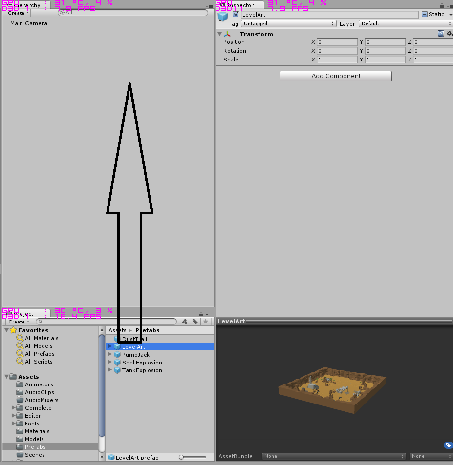
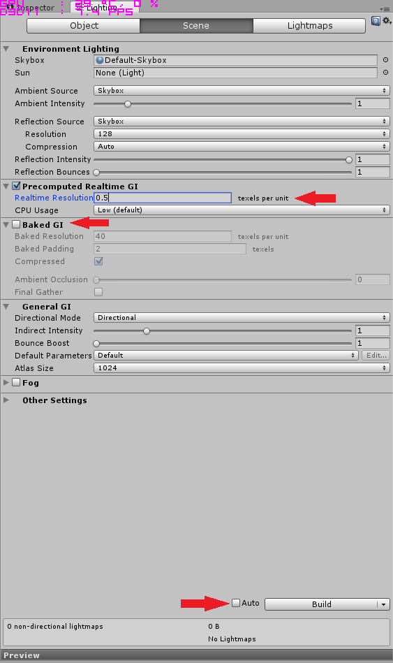
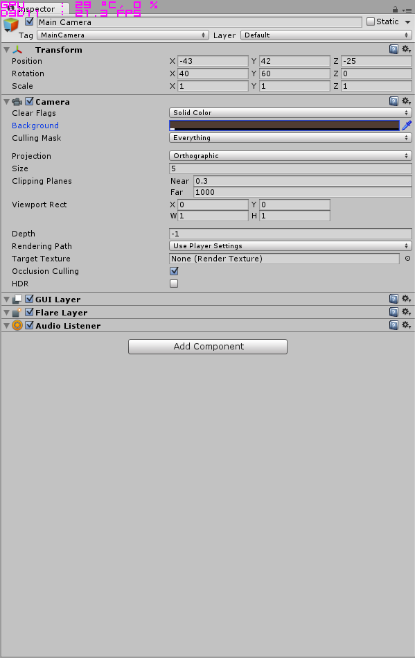
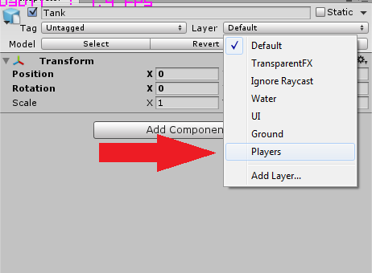
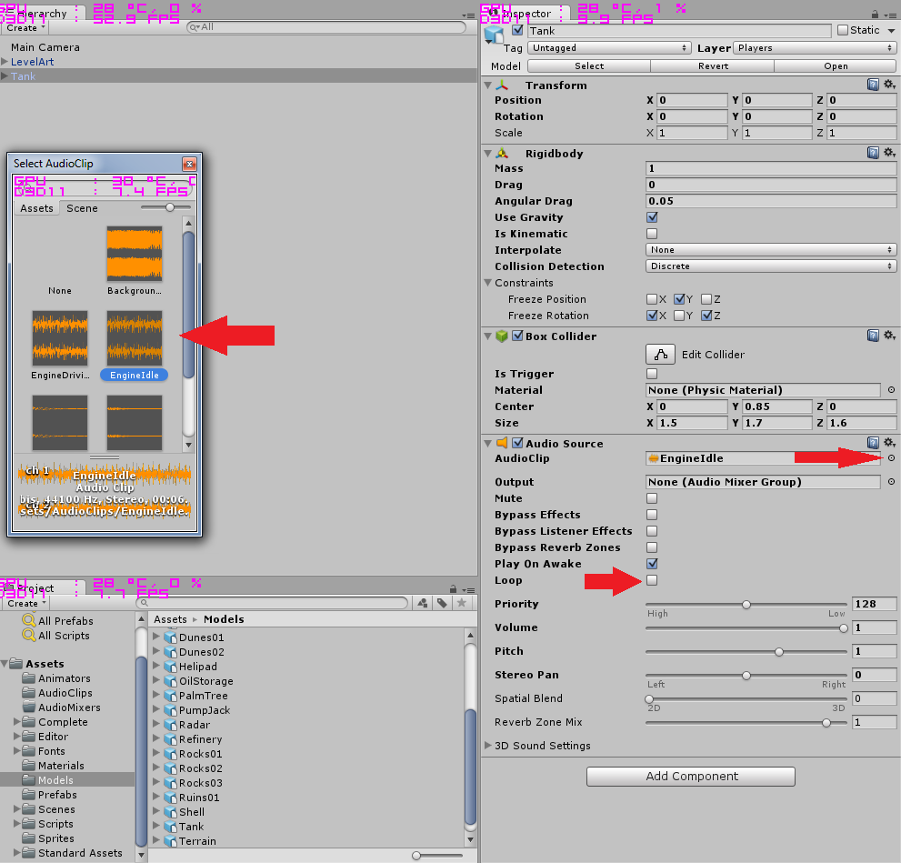
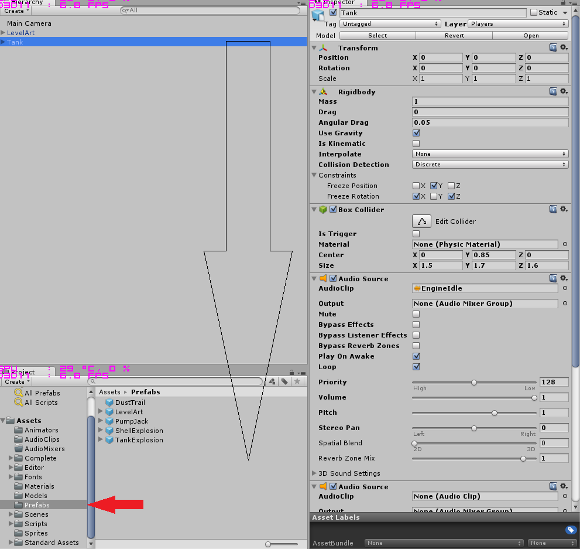

# Tanks
Denne oppgaven tar utgangspunkt i [dette](http://unity3d.com/learn/tutorials/projects/tanks-tutorial) prosjektet på Unity sine sider.

Først så må vi starte Unity og velge et nytt prosjekt. Prosjektet kan man kalle hva man selv vil, vi kommer til å kalle det for Tanks i denne tutorialen. Når vi har åpnet Unity så må vi laste ned alle prosjekt filene, dette gjør vi ved å velge **Window** oppe på verktøylinjen og velger **Asset Store**. Inne i **Asset Store** så søker vi på **Tanks Tutorial**. Når vi har funnet prosjektet så klikker vi på Download og Import etter nedlastingen er ferdig.


## 1 Sette Opp Prosjektet

- Velg `File -> New Scene` oppe på verktøylinjen for å lage en ny Scene, lagre den nye scenen som `Main` i `Scenes` mappen.
- Slett lyskilden som heter `Directional Light` i hierarkiet fra scenen.
- Dra `Prefaben` som heter **Level Art** inn i hierarkiet. Denne ligger i mappen `Prefabs` i prosjektet:



- Fra `Window` menyen, åpne `Lighting` panelet. På dette panelet så skrur vi av **Auto** helt nederst på vinduet og **Baked GI**. Under **Precomputed Realtime GI** så setter vi `Realtime Resolution` til 0.5:



- Under **Environment Lighting** forandre `Ambient Source` fra `Skybox` til `Color` og bytt fargen til RGB verdiene (72,62,113).
- Klikk Build nederst på Panelet.
- Lukk `Lighting` panelet, eller klikk på `Inspector` panelet.
- Velg `Main Camera` fra hierarkiet og bytt posisjon til (-43,42,-25)
- Bytt rotasjon til (40,60,0)
- Forandre kameraet sin `Projection` til `Ortographic`
- Forandre kameraet sin `Clear Flags` fra `Skybox` til `Solid Color`.
- Forandre `Background` farge til RGB (80,60,50)
- Lagre Scenen din.



# Miniquiz

### Hva kalles de tre koordinatene vi bruker til å si posisjonen til noe i Unity?
1. ZXE
2. BHD
3. XYZ
4. ABC

### Hvilke 3 farger består RGB av?
1. Rød, Gul, Brun
2. Rosa, Grønn, Beige
3. Rosa, Grønn, Burgunder
4. Rød, Grønn, Blå


## 2 Lage En Tank

- Under mappen `Models` finner du en modell som heter `Tank`. Dra denne inn i hierarkiet, på samme måte som vi gjorde med `LevelArt`.
- Forandre `Layer` til tanksen slik at den ligger på `Players` layeret. I Dialogboksen velger du `No, for this object only`



- Legg til en `Rigidbody` til tanksen.
- Under `Constraints` inne i `Rigidbody`, huk av for `Freeze Position` på Y-aksen, og huk av for `Freeze Rotation` på X-aksen og Z-aksen.
- Legg til en `Box Collider` på tanksen og forandre `Center` til (0, 0.85, 0) og forandre størrelsen til (1.5, 1.7, 1.6).
- Legg til en `Audio Source` til tanksen vår og forandre `Audio Clip` til `Engine Idle`. Huk også av for `Loop`.



- Legg til en ekstra `Audio Source` på tanksen vår og slå av `Play On Awake`.
- Velg `Prefabs` mappen i prosjektet vårt og dra tanksen ned til mappen, det som skjer er at vi lager en `Prefab` av tanksen vi har lagd til nå. En `Prefab` er et ferdiglaget objekt som inneholder alt vi har lagt til tanksen vår til nå.



- Fra `Prefabs` mappen, dra `DustTrail` prefaben til tanksen vår i hierarkiet, slik at den blir en `Child` av tanks objektet vårt.
- Dupliser `DustTrail` ved å bruke Ctrl + D slik at vi får to `DustTrail` på tanksen vår. Gi den nye `DustTrail` navnet `LeftDustTrail` og den andre navnet `RightDustTrail`.
- Sett posisjonen til `LeftDustTrail` til (-0.5, 0, -0.75) og posisjonen til `RightDustTrail` til (0.5, 0, -0.75)

### Tid for litt Kode
- I `Scripts/Tank` folderen så finner vi et script som heter `TankMovement`, dra denne over på tanksen vår i hierarkiet.
- Dobbelklikk på `TankMovement` scriptet for å åpne scriptet i Visual Studio eller MonoDevelop.
- I scriptet så har vi noen ferdiglagde funksjoner, disse er kommentert ut, så vi må fjerne kommentar tegnene `/* */`
- Koden for scriptet ligger under, men vi vil gjerne tenke oss frem til hva vi vil gjøre først.

```

 	private void Update ()
    {
        // Store the value of both input axes.
        m_MovementInputValue = Input.GetAxis (m_MovementAxisName);
        m_TurnInputValue = Input.GetAxis (m_TurnAxisName);

        EngineAudio ();
    }


    private void EngineAudio ()
    {
        // If there is no input (the tank is stationary)...
        if (Mathf.Abs (m_MovementInputValue) < 0.1f && Mathf.Abs (m_TurnInputValue) < 0.1f)
        {
            // ... and if the audio source is currently playing the driving clip...
            if (m_MovementAudio.clip == m_EngineDriving)
            {
                // ... change the clip to idling and play it.
                m_MovementAudio.clip = m_EngineIdling;
                m_MovementAudio.pitch = Random.Range (m_OriginalPitch - m_PitchRange, m_OriginalPitch + m_PitchRange);
                m_MovementAudio.Play ();
            }
        }
        else
        {
            // Otherwise if the tank is moving and if the idling clip is currently playing...
            if (m_MovementAudio.clip == m_EngineIdling)
            {
                // ... change the clip to driving and play.
                m_MovementAudio.clip = m_EngineDriving;
                m_MovementAudio.pitch = Random.Range(m_OriginalPitch - m_PitchRange, m_OriginalPitch + m_PitchRange);
                m_MovementAudio.Play();
            }
        }
    }


    private void FixedUpdate ()
    {
        // Adjust the rigidbodies position and orientation in FixedUpdate.
        Move ();
        Turn ();
    }


    private void Move ()
    {
        // Create a vector in the direction the tank is facing with a magnitude based on the input, speed and the time between frames.
        Vector3 movement = transform.forward * m_MovementInputValue * m_Speed * Time.deltaTime;

        // Apply this movement to the rigidbody's position.
        m_Rigidbody.MovePosition(m_Rigidbody.position + movement);
    }


    private void Turn ()
    {
        // Determine the number of degrees to be turned based on the input, speed and time between frames.
        float turn = m_TurnInputValue * m_TurnSpeed * Time.deltaTime;

        // Make this into a rotation in the y axis.
        Quaternion turnRotation = Quaternion.Euler (0f, turn, 0f);

        // Apply this rotation to the rigidbody's rotation.
        m_Rigidbody.MoveRotation (m_Rigidbody.rotation * turnRotation);
    }
```


### Hva er en Prefab?
1. En Unity pakke for Grafikk
2. Et ferdiglagd objekt som vi kan bruke i Unity
3. Et bilde
4. En ny smarttelefon